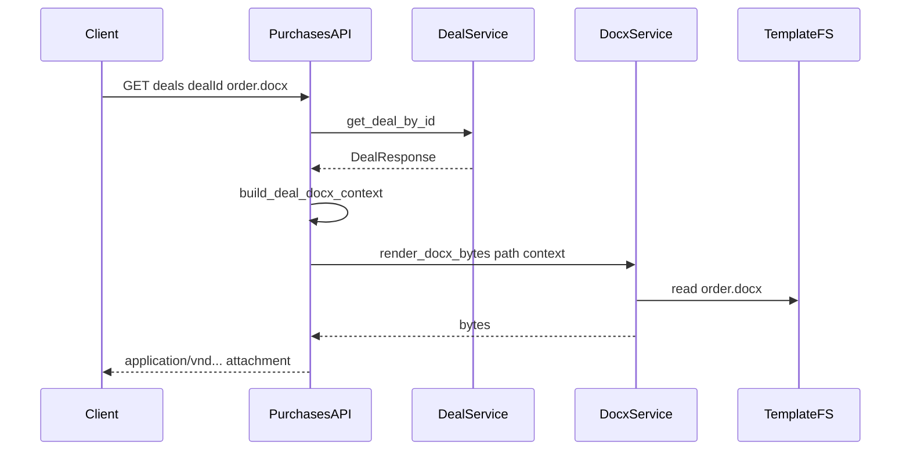
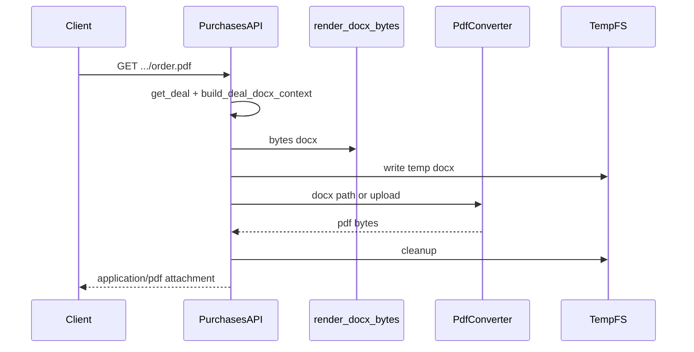

# DOCX на бэкенде: контекст для агента

Документ для **другого агента / разработчика**: что уже сделано в репозитории, как устроен поток данных и **пошагово**, как менять или расширять функциональность. Экспорт в **PDF** реализован через **Gotenberg** (см. §3.1, [gotenberg_pdf_service.py](../backend/app/api/purchases/services/gotenberg_pdf_service.py)); расширенный **план и варианты** — в [§9](#pdf-plan).

---

## 1. Цель системы

- Пользователь с доступом к сделке запрашивает **GET** с URL вида  

  `/api/v1/purchases/deals/{deal_id}/documents/<имя>.docx`.

- Бэкенд загружает сделку (`DealResponse`), строит **словарь контекста** для Jinja2, подставляет его в **файл-шаблон** `.docx` из каталога на диске и отдаёт **бинарный ответ** с `Content-Disposition: attachment`.

Зависимость: **docxtpl** (обёртка над `python-docx` + Jinja2).

---

## 2. Краткая карта файлов

| Роль | Путь |

|------|------|

| Константы имён файлов шаблонов | [backend/app/api/purchases/services/docx_template_service.py](../backend/app/api/purchases/services/docx_template_service.py) |

| Путь к каталогу шаблонов | [backend/app/core/config.py](../backend/app/core/config.py) — `DOCX_TEMPLATES_DIR` (по умолчанию `app/templates/docx` относительно `BASE_DIR` = `backend/app`; переопределение через env, см. §3.4) |

| Контекст Jinja из сделки | [backend/app/api/purchases/deal_docx_context.py](../backend/app/api/purchases/deal_docx_context.py) — `build_deal_docx_context` |

| HTTP-маршруты | [backend/app/api/purchases/router.py](../backend/app/api/purchases/router.py) — `_serve_deal_docx` / `_serve_deal_pdf` + по четыре `GET` на `.docx` и `.pdf` |
| Конвертация DOCX→PDF (Gotenberg) | [backend/app/api/purchases/services/gotenberg_pdf_service.py](../backend/app/api/purchases/services/gotenberg_pdf_service.py) |

| Шаблоны Word на диске | [backend/app/templates/docx/](../backend/app/templates/docx/) |

| Справка по полям Jinja и синтаксису | [backend/app/templates/docx/README.md](../backend/app/templates/docx/README.md) |

| Пересборка минимальных шаблонов счетов (bill / bill_contract / bill_offer) | [backend/scripts/build_minimal_deal_docx_templates.py](../backend/scripts/build_minimal_deal_docx_templates.py) |

| Семантика сделки и API | [docs/DEAL_AGENT_CONTEXT.md](DEAL_AGENT_CONTEXT.md) |

| Тесты API | [backend/tests/test_purchases_deals_api.py](../backend/tests/test_purchases_deals_api.py) |

| URL для фронта | [frontend/constants/urls.ts](../frontend/constants/urls.ts) — `DOWNLOAD_DEAL_DOCX_*` |

| Клиент: blob + скачивание | [frontend/composables/useDocxGenerator.ts](../frontend/composables/useDocxGenerator.ts) — DOCX и PDF (`fetchDealGenerated*Blob`, `downloadDealGenerated*`) |

| Кнопка DOC в редакторе | [frontend/components/EditorMenu/index.vue](../frontend/components/EditorMenu/index.vue) |

| Профиль «Документы» (строки заказ/счёт из API) | [frontend/pages/profile/documents.vue](../frontend/pages/profile/documents.vue) |

---

## 3. Текущее состояние (факт)

### 3.1 Эндпоинты

Базовый префикс приложения: `API_V1_STR` (обычно **`/api/v1`**) + **`/purchases`**.

| GET path (относительно `/api/v1/purchases`) | Файл шаблона в `DOCX_TEMPLATES_DIR` | Префикс имени скачивания |

|---------------------------------------------|--------------------------------------|---------------------------|

| `/deals/{deal_id}/documents/order.docx` | `order.docx` | `order-deal-{id}.docx` |

| `/deals/{deal_id}/documents/bill.docx` | `bill.docx` | `bill-deal-{id}.docx` |

| `/deals/{deal_id}/documents/bill-contract.docx` | `bill_contract.docx` | `bill-contract-deal-{id}.docx` |

| `/deals/{deal_id}/documents/bill-offer.docx` | `bill_offer.docx` | `bill-offer-deal-{id}.docx` |

**PDF** (тот же рендер docxtpl, затем **Gotenberg** `/forms/libreoffice/convert`, см. [gotenberg_pdf_service.py](../backend/app/api/purchases/services/gotenberg_pdf_service.py); нужен **`GOTENBERG_URL`** в настройках):

| GET path (относительно `/api/v1/purchases`) | Источник | Префикс имени скачивания |

|---------------------------------------------|----------|---------------------------|

| `/deals/{deal_id}/documents/order.pdf` | `order.docx` → PDF | `order-deal-{id}.pdf` |

| `/deals/{deal_id}/documents/bill.pdf` | `bill.docx` → PDF | `bill-deal-{id}.pdf` |

| `/deals/{deal_id}/documents/bill-contract.pdf` | `bill_contract.docx` → PDF | `bill-contract-deal-{id}.pdf` |

| `/deals/{deal_id}/documents/bill-offer.pdf` | `bill_offer.docx` → PDF | `bill-offer-deal-{id}.pdf` |

Авторизация: как у `GET /purchases/deals/{deal_id}` (JWT / cookie — см. проект). Доступ только участникам сделки.

Ошибки **.docx**: **404** — нет компании у пользователя или сделка недоступна; **500** — файл шаблона отсутствует на диске (в `detail` фигурирует имя файла). При **ошибке Jinja** (например `UndefinedError`, `TemplateSyntaxError`) запрос может завершиться **500** без отдельного сообщения для клиента — см. §3.3.

Ошибки **.pdf**: те же **404**; **503** — не задан `GOTENBERG_URL`; **502** — недоступен Gotenberg или ошибка конвертации; **500** — нет шаблона `.docx`; **413** — превышен `GOTENBERG_MAX_DOCX_BYTES`.

### 3.2 Контекст шаблона

`build_deal_docx_context(deal)`:

1. `deal.model_dump(mode="json", by_alias=True)` — структура как в JSON API (важно для `buyer_company.company_id`, `owner_name`, `account_number` и т.д.).

2. Дополнительно строки дат **`ДД.ММ.ГГГГ`**: `contract_date_fmt`, `bill_date_fmt`, `supply_contracts_date_fmt`, `created_at_fmt`, `updated_at_fmt`.

3. **`total`** — дублирует `total_amount` (для старых шаблонов / совместимости с клиентской генерацией, где использовалось имя `total`).

Если в шаблоне нужны **новые** вычисляемые поля — расширяй `build_deal_docx_context`, не дублируй логику в роутере.

### 3.3 Шаблоны Word и типичные сбои

- **Правило docxtpl**: выражения `{{ … }}` и теги `` должны находиться в **одном непрерывном фрагменте текста** в XML документа. Если Word разбивает плейсхолдер на несколько *runs*, Jinja получает мусор (`{{ </w:t>…`) → **`TemplateSyntaxError`** или пустой/битый вывод.

- Шаблоны **`bill.docx`**, **`bill_contract.docx`**, **`bill_offer.docx`** при необходимости можно заново собрать минимально корректными скриптом из репозитория:  

  из каталога `backend`:  

  `python scripts/build_minimal_deal_docx_templates.py`  

  (python-docx; плейсхолдеры в одном run). После этого вёрстку можно наращивать в Word **осторожно**, не разрывая теги.

### 3.4 Каталог шаблонов (env)

В [config.py](../backend/app/core/config.py) поле **`DOCX_TEMPLATES_DIR`** объявлено в `Settings` (Pydantic Settings): путь по умолчанию `BASE_DIR / "templates" / "docx"`. Для деплоя можно задать **`DOCX_TEMPLATES_DIR`** в окружении (абсолютный путь к каталогу с `.docx`).

Для **PDF**: **`GOTENBERG_URL`** (например `http://gotenberg:3000` в Docker Compose), опционально **`GOTENBERG_TIMEOUT_SECONDS`** (по умолчанию 60), **`GOTENBERG_MAX_DOCX_BYTES`** (по умолчанию 20 МБ).

### 3.5 Фронтенд (реализовано)

- Те же **GET**, что в таблице §3.1; база URL и **Bearer/cookie** — как у `$api` ([plugins/api.ts](../frontend/plugins/api.ts)).

- Константы путей: **`DOWNLOAD_DEAL_DOCX_*`** и **`DOWNLOAD_DEAL_PDF_*`** в [urls.ts](../frontend/constants/urls.ts).

- [useDocxGenerator.ts](../frontend/composables/useDocxGenerator.ts): `fetchDealGeneratedDocxBlob` / `downloadDealGeneratedDocx`, `fetchDealGeneratedPdfBlob` / `downloadDealGeneratedPdf` (`responseType: 'blob'`).

- Редактор: кнопки **DOC** и **PDF** вызывают бэкенд; для вкладки счёта вариант по **`Editor.BILL_TYPE`** (`bill` / `bill-contract` / `bill-offer`).

- Файлы [docxOrder.ts](../frontend/public/templates/docxOrder.ts) и [docxBill.ts](../frontend/public/templates/docxBill.ts) **больше не используются** основным потоком скачивания; можно оставить как справку или удалить при очистке.

### 3.6 Зависимости

В [backend/requirements.txt](../backend/requirements.txt): `docxtpl>=0.16.7,<0.19.0`.

### 3.7 Локальный прогон тестов API

Интеграционные тесты в [test_purchases_deals_api.py](../backend/tests/test_purchases_deals_api.py) поднимают приложение и БД. Если в `.env` указан **PostgreSQL**, а сервер не запущен, фикстура упадёт. Для быстрой проверки docx без Postgres можно временно задать, например:  

`SQLALCHEMY_DATABASE_URL=sqlite:///./pytest_local.db`  

(из каталога `backend`), затем `pytest tests/test_purchases_deals_api.py::test_download_order_docx_success -v`.

---

## 4. Поток данных (как отлаживать)

Если **500** с текстом про отсутствующий шаблон — проверь путь `DOCX_TEMPLATES_DIR` и имя файла. Если **пустые поля** в документе — проверь ключи в Jinja и `model_dump(by_alias=True)`. Если **500** при рендере без понятного текста — открой шаблон в Word/XML и проверь целостность `{{` / `{%` (§3.3).

---

## 5. Чеклист перед merge

- [ ] Константа имени файла в `docx_template_service.py` согласована с файлом в `templates/docx/`.

- [ ] Роут зарегистрирован **до** конфликтующих путей (у FastAPI порядок и специфичность путей важны; сейчас литералы `*.docx` не пересекаются с `/{document_id}` целочисленным).

- [ ] Документация в этом файле и при необходимости в `templates/docx/README.md` обновлена; при новом URL — фронт (`urls.ts`, `useDocxGenerator`).

- [ ] Тесты или ручная проверка через `/docs`.

---

## 6. Вне объёма текущей реализации

- Альтернативные движки PDF / доработки конвейера — см. [§9](#pdf-plan) (Gotenberg уже подключён в compose и коде).

- Загрузка шаблонов из S3 без локального файла (сейчас только файловая система по `DOCX_TEMPLATES_DIR`).

---

## 7. Часть для автора шаблонов Word (ручные шаги)

- Редактируй файлы в [backend/app/templates/docx/](../backend/app/templates/docx/) с именами из констант (`order.docx`, `bill.docx`, …).

- Синтаксис плейсхолдеров: Jinja2 — см. [backend/app/templates/docx/README.md](../backend/app/templates/docx/README.md).

- Ограничение Word: не разбивать `{{ ... }}` и `` на несколько фрагментов с разным форматированием внутри одного плейсхолдера; при сомнениях — набрать плейсхолдер целиком «с нуля» или использовать скрипт §3.3 как основу.

---

## 8. План конвертации DOCX в PDF

Цель: после заполнения шаблона (как сейчас через docxtpl) отдавать пользователю **тот же документ в PDF** с теми же правами доступа, что и для `.docx`.

### 9.1 Исходные данные в проекте

- Уже есть **байты готового DOCX**: `render_docx_bytes()` в [docx_template_service.py](../backend/app/api/purchases/services/docx_template_service.py).

- Повторно использовать **`build_deal_docx_context`** и проверки доступа из `_serve_deal_docx`; конвертация — **второй шаг** после рендера (не подменять цепочку docxtpl).

### 9.3 Поток данных (целевой)

Альтернатива без временного файла на диске API: streaming multipart в Gotenberg, если поддерживается; иначе **временный файл в `tempfile.TemporaryDirectory`** с уникальным именем и гарантированным удалением в `finally`.

### 9.4 HTTP API (предложение)

Симметрия с существующими маршрутами:

- `GET /api/v1/purchases/deals/{deal_id}/documents/order.pdf`

- `GET .../bill.pdf`, `.../bill-contract.pdf`, `.../bill-offer.pdf`

Поведение: те же **404/401**, что у `.docx`; **415/500** при сбое конвертера с безопасным `detail` (без путей к temp). `Content-Type: application/pdf`, `Content-Disposition: attachment; filename="order-deal-{id}.pdf"`.

Опционально позже: query `?format=pdf|docx` на одном URL — усложняет кэш и OpenAPI; для первой версии отдельные пути проще.

### 9.5 Конфигурация

В [config.py](../backend/app/core/config.py) (или отдельный модуль):

- `PDF_CONVERSION_ENABLED: bool`

- `PDF_CONVERTER_MODE: literal["none", "gotenberg", "libreoffice_cli"]`

- `GOTENBERG_URL: str | None` (например `http://gotenberg:3000`)

